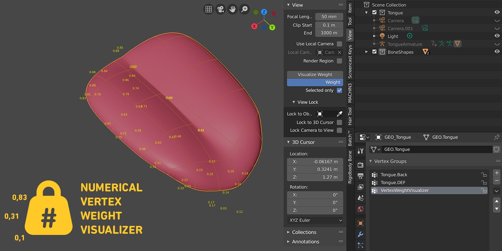
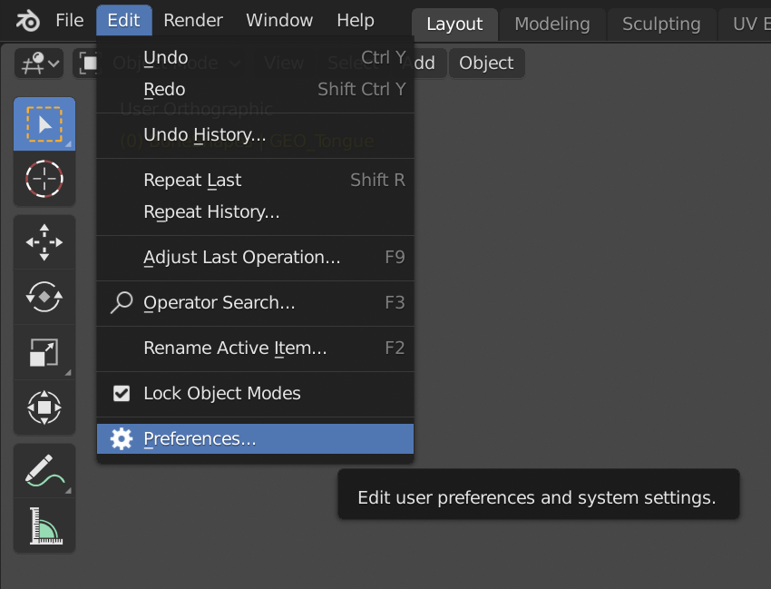
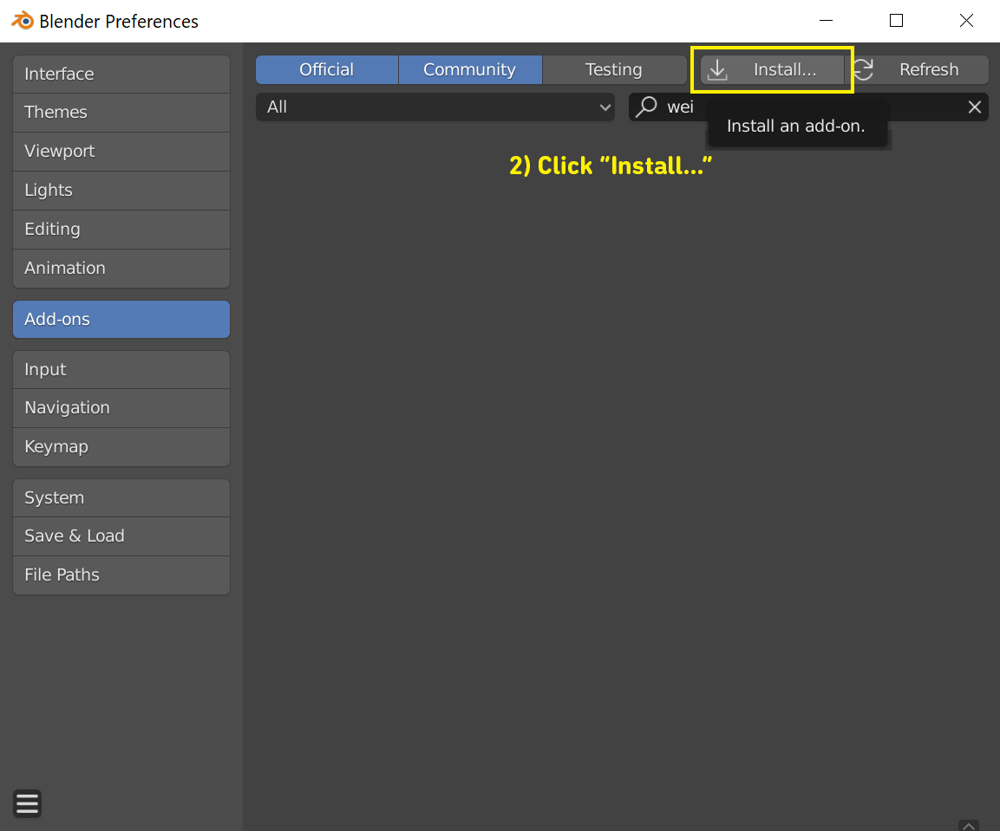
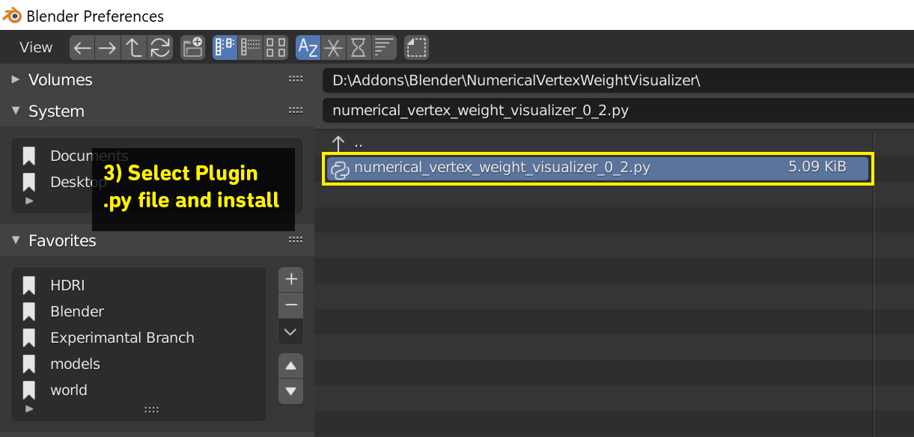
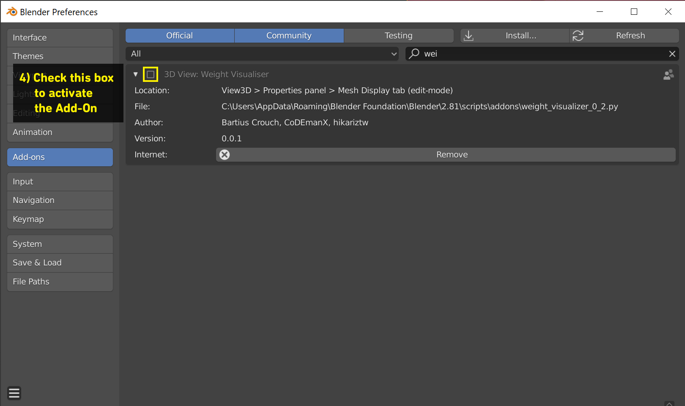

# Numerical Vertex Weight Visualizer

Blender Add-On that displays selected Vertex Weight on the mesh numerically
Tested in 2.8 Stable

## Installation

Edit -> Preferences -> Add-Ons 

Install...

Find add-on .py file

Check add-on box in the list to activate

## Usage
'3D View > Properties panel > View tab

## Credits to:
Bartius Crouch, 
CoDEmanX, 
hikariztw
